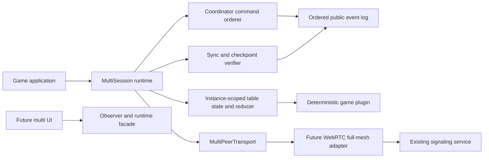

# Architecture

## Purpose and boundary

`p2p-lockstep-kit-multisession` is a publishable, browser-compatible TypeScript
library for deterministic three-to-twenty-participant turn-based sessions. It is not
a game, UI, lobby, matchmaking service, signaling server or authoritative game
server.

The physical topology is a reliable ordered WebRTC data-channel full mesh. The
logical topology is coordinator-ordered: the coordinator converts eligible
commands into an immutable global event sequence, while every participant
independently validates and reduces those events.



Dependency arrows point inward through interfaces. Core code never imports the
legacy `NetworkClient`, DOM globals or a concrete signaling implementation.

## Identity domains

All identifier types are opaque branded strings at the TypeScript boundary and
validated strings at runtime:

- `TableId` identifies the private table lifecycle.
- `GameId` identifies one game at that table. Restart/new-game history cannot
  cross this boundary.
- `ParticipantId` is stable table membership and survives peer replacement.
- `PeerId` is the current signaling/WebRTC address.
- `SeatId` is a game-defined seat or role and is not a participant.
- `EventId` and `MessageId` provide event and wire-message identity.

Participant-to-peer binding is membership state. Replacing a peer ID requires a
validated resume credential and an ordered membership event; it never changes
the participant ID or rewrites historical actor IDs.

## Modules

| Module | Responsibility |
| --- | --- |
| `ids` | Branded identifiers and strict runtime constructors |
| `protocol` | Versioned message union, runtime schemas, canonical encoding and parse errors |
| `transport` | `MultiPeerTransport`, fake mesh, connection snapshots and unsubscribe contracts |
| `membership` | Join/resume/peer binding, roster and seat membership invariants |
| `coordinator` | Command eligibility, sequence allocation and event construction |
| `event-log` | Hash chain, idempotence, gap buffering, replay and conflict stop |
| `decision-window` | Intent collection and deterministic plugin resolution |
| `sync` | Tail/checkpoint selection, verification and peer cross-check |
| `state` | Immutable table/game reducer and public state |
| `plugin` | Generic deterministic game extension and hidden-information extension points |
| `observer` | Read-only UI snapshot, errors and unsubscribe-safe subscriptions |
| `runtime` | Instance-scoped lifecycle, routing, actions, page-resume hook and disposal |

## Transport contract

The session depends on a transport with these capabilities, with exact names to
be finalized in source without weakening the contract:

```ts
interface MultiPeerTransport {
  readonly localPeerId: PeerId | null;
  connect(peerId: PeerId): Promise<void>;
  disconnect(peerId: PeerId): void;
  sendTo(peerId: PeerId, message: unknown): void;
  broadcast(message: unknown, except?: ReadonlySet<PeerId>): void;
  getPeerState(peerId: PeerId): PeerConnectionState;
  getConnectedPeerIds(): readonly PeerId[];
  onMessage(handler: (peerId: PeerId, message: unknown) => void): Unsubscribe;
  onPeerStateChange(
    handler: (peerId: PeerId, state: PeerConnectionState) => void,
  ): Unsubscribe;
  dispose(): void;
}
```

The adapter owns `Map<PeerId, RtcPeerLike>`. For each unordered peer pair, the
peer whose validated Peer ID compares lower by UTF-8 bytes is the only initial
offerer. Negotiation uses a bounded queue (recommended default: three active
negotiations). A failed peer is repaired independently with a new peer
connection. One reliable ordered data channel carries multiplexed protocol
messages.

`meshReady` means every currently required participant with a peer binding is
connected to the local peer (excluding the local participant). At least one
connection is never sufficient.

## Join and local lifecycle

```mermaid
stateDiagram-v2
  [*] --> invited
  invited --> joining: connect coordinator and send JOIN_REQUEST
  joining --> mesh_connecting: MEMBERSHIP_JOINED accepted and roster verified
  joining --> invited: rejected or cancelled
  mesh_connecting --> seated: required direct peers connected and seat assigned
  mesh_connecting --> syncing: roster has existing public history
  syncing --> seated: complete record verified
  seated --> ready: local readiness accepted
  ready --> seated: local readiness cleared
  ready --> playing: GAME_STARTED applied
  playing --> offline: any required participant disconnects
  seated --> offline: any required participant disconnects
  ready --> offline: any required participant disconnects
  offline --> syncing: complete mesh restored
  syncing --> playing: complete record verified; resume playing
  syncing --> seated: complete record verified; resume seated
  syncing --> ready: complete record verified; resume ready
  playing --> ended: terminal outcome applied
  invited --> protocol_error: invalid trusted context
  joining --> protocol_error: protocol conflict
  mesh_connecting --> protocol_error: protocol conflict
  seated --> protocol_error: protocol conflict
  ready --> protocol_error: protocol conflict
  playing --> protocol_error: protocol conflict
  offline --> protocol_error: protocol conflict
  syncing --> protocol_error: protocol conflict
```



This is an instance-local lifecycle view. Readiness for every participant is
also retained in a map. The instance has one exact participant count in the
inclusive range 3-20. Play requires every seat occupied and every participant
ready. Membership and seats are frozen from start until restart.

## State and reducer

The public core state has one table/game lifecycle and maps for participant
facts; it never creates one complete session FSM per participant.

```ts
interface MultiSessionState<TGameState = unknown> {
  tableId: TableId;
  gameId: GameId | null;
  phase: SessionPhase;
  localParticipantId: ParticipantId;
  coordinatorId: ParticipantId;
  coordinatorEpoch: number;
  participants: ReadonlyMap<ParticipantId, Participant>;
  seats: ReadonlyMap<SeatId, ParticipantId | null>;
  ready: ReadonlyMap<ParticipantId, boolean>;
  connections: ReadonlyMap<ParticipantId, PeerConnectionState>;
  lastAppliedSeq: number;
  lastEventHash: string | null;
  pendingDecisionWindow: DecisionWindow | null;
  pendingProposals: readonly Proposal[];
  sync: SyncState;
  outcome: GameOutcome | null;
  game: TGameState | null;
  protocolError: ProtocolError | null;
}
```

Reducers are pure. Runtime effects (hashing, transport, timers and persistence)
are outside reducers and feed validated actions/events back in. Public snapshots
clone or freeze collections so consumers cannot mutate runtime state.

## Game plugin

The plugin is generic over command, ordered game event, game state and snapshot.
It must be deterministic and must not inspect transport, wall-clock time, DOM or
unrecorded randomness. It provides:

- deterministic game rules for the instance-supplied participant count;
- deterministic initial state;
- command eligibility and conversion guidance for the coordinator;
- independent validation and pure reduction of ordered game events;
- the current actor set or decision window;
- deterministic simultaneous-intent resolution;
- winner, draw, multiple-winner, ranking or aborted outcome;
- serializable public checkpoint data and replay restoration.

v1 has no automatic operation deadline or timeout consequence. Reducers never
call `Date.now()` to decide game results.

v1 offers no hidden-information or anti-cheat guarantee. Applications may keep
UI-level distinctions, but the session is allowed to synchronize the complete
existing record and a participant can inspect or alter locally available data.

## Decision windows

A sequential turn is a single-eligible-participant window. A simultaneous
window collects at most one current intent per eligible participant (replacement
rules are plugin-defined), records submissions without revealing private data,
and closes through an ordered resolution event. The plugin resolves priority
from public deterministic inputs. Mahjong-specific action priority is not in
this library.

## Failure model

- Malformed, wrong-version, wrong-table, wrong-game and unauthorized messages
  are rejected before state mutation and surfaced as structured errors.
- Duplicate messages/events are idempotent.
- A sequence gap buffers a bounded future tail, stops application and requests
  a complete-record sync.
- A broken previous hash or two hashes for one epoch/sequence transitions to a
  terminal protocol-conflict state; the runtime never selects a history.
- Sync disables local game commands until complete-record verification finishes.
- Losing any required peer changes that participant's connection state and
  immediately places the whole local session in `offline`; no game command is
  accepted until the complete mesh reconnects and sync finishes.

## Runtime lifecycle

Every `createMultiSession` call constructs independent handlers, state,
observer, transport subscriptions and timers. It returns `dispose()`; disposal
is idempotent and removes all listeners, clears all timers and pending queues,
and disposes owned fake/real transport resources. No global context or singleton
is permitted.

The page-resume API checks every required peer state plus local sequence/hash,
repairs only missing links and enters sync when checkpoints disagree. It does
not reload the page and does not equate signaling resume with session recovery.

## Delivery phases

1. Scaffold strict TypeScript library tooling and implement IDs, schemas, event
   log, reducer/plugin contracts, coordinator ordering and fake mesh tests.
2. Add full-record sync, cross-check, participant continuity and peer-specific
   offline/online recovery.
3. After repository authorization, implement the backward-compatible network
   adapter and browser matrix.
4. Complete package exports, documentation, tarball consumer smoke test and
   frozen install/build/test/pack acceptance.
