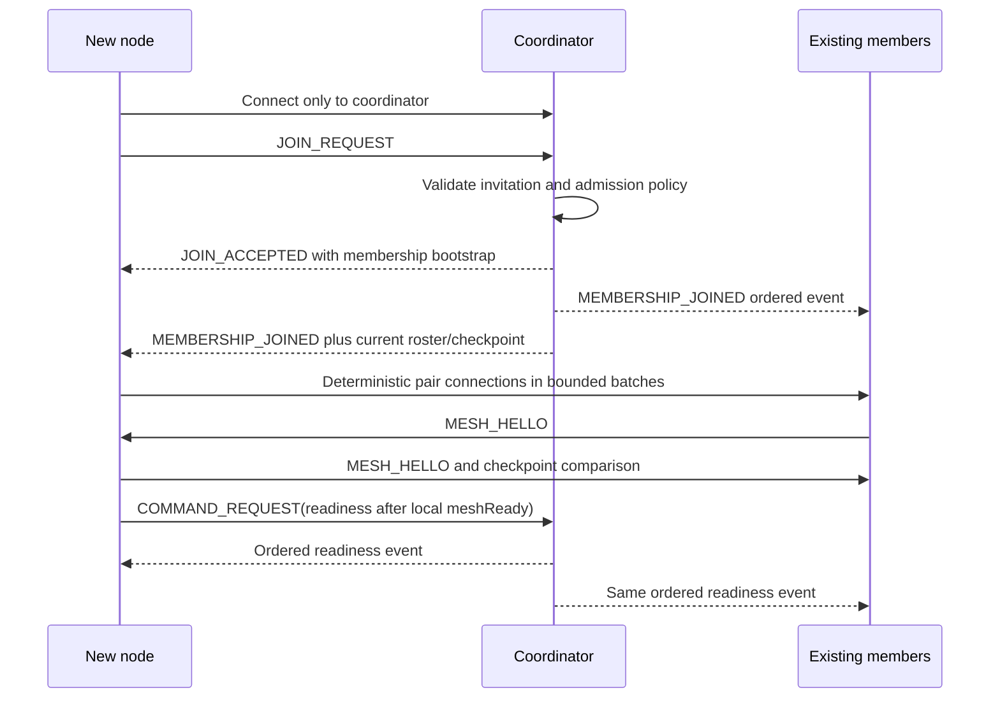

# Protocol v1 draft

This document fixes the confirmed v1 safety invariants and wire structure.

## Envelope

Every data-channel message is a runtime-validated member of a discriminated
union with this common envelope:

```ts
interface Envelope<TType extends string, TPayload> {
  protocol: "p2p-lockstep-kit-multisession";
  version: 1;
  messageId: MessageId;
  type: TType;
  tableId: TableId;
  gameId: GameId | null;
  senderParticipantId: ParticipantId | null;
  senderPeerId: PeerId;
  payload: TPayload;
}
```

`senderParticipantId` may be `null` only for an initial `JOIN_REQUEST`. All
other messages must match the authenticated table membership binding for the
transport's actual source peer. A claimed `senderPeerId` must equal that source.

Parsers reject unknown protocol names/versions, absent fields, non-finite
numbers, unsafe integers, unknown message types, oversized identifiers and
payloads that fail the type-specific schema. TypeScript assertions are not
input validation. Initial implementation limits must be explicit constants and
covered by boundary tests.

## Message union

The initial union is grouped by responsibility:

| Type | Direction | Purpose |
| --- | --- | --- |
| `JOIN_REQUEST` | candidate to coordinator | Present invitation context and requested participant/resume data |
| `JOIN_ACCEPTED` / `JOIN_REJECTED` | coordinator to candidate | Supply accepted membership bootstrap or structured rejection |
| `MESH_HELLO` | peer to peer | Confirm table, participant and current peer binding on a direct link |
| `COMMAND_REQUEST` | member to coordinator | Submit a core/game command with a unique command ID |
| `ORDERED_EVENTS` | coordinator/member sync source to member | Carry one or a bounded contiguous event batch |
| `EVENT_ACK` | member to all connected members | Cross-check an epoch/sequence/hash checkpoint |
| `SYNC_REQUEST` | member to preferred sync source | Report local sequence/hash and request recovery |
| `SYNC_STATE` | sync source to member | Return tail-only or checkpoint-plus-tail data |
| `PRIVATE_MESSAGE` | member to member | Optional application data; v1 gives it no confidentiality or anti-cheat guarantee |
| `PROTOCOL_ERROR` | member to source when safe | Report a non-secret structured rejection; never resolve a conflict |

`messageId` deduplication applies before command or state handling. The cache is
bounded and can evict identifiers only below a verified checkpoint horizon.

## Ordered public events

```ts
interface OrderedEvent<TType extends string = string, TPayload = unknown> {
  eventId: EventId;
  tableId: TableId;
  gameId: GameId;
  seq: number;
  coordinatorEpoch: number;
  actorId: ParticipantId;
  type: TType;
  payload: TPayload;
  previousHash: string | null;
  eventHash: string;
}
```

Core event types (membership, peer binding, seats, readiness, start/end,
proposal/vote and lifecycle events) and plugin event types each have their own
payload schema. A generic `unknown` payload is never passed to a reducer.

For protocol v1, `eventHash` is lowercase hexadecimal SHA-256 over the RFC 8785
JSON Canonicalization Scheme encoding of every event field except `eventHash`.
Values outside that scheme are rejected before hashing. The implementation will
use standard test vectors and must produce identical bytes in browser and Node
runtimes.

Sequence and hash continuity are table-global: the first table event has
`seq = 1` and `previousHash = null`; neither value resets when a new `GameId` is
opened. The table creates a current `GameId` before admitting participants, so
pre-play membership and seating events are scoped to that pending game. A
`GAME_RESTARTED` is scoped to the old game and carries `nextGameId`; after it is
applied, subsequent events use the new `GameId`. Reducers and commands cannot
read prior-game events as current game history even though the table audit chain
remains continuous.

## Command-to-event ordering

```mermaid
sequenceDiagram
  participant P as Participant
  participant C as Coordinator
  participant M as Other mesh peers
  P->>C: COMMAND_REQUEST(commandId, expectedSeq, payload)
  C->>C: Validate membership, phase, command and current plugin state
  C->>C: Allocate seq and build/hash event(s)
  C-->>P: ORDERED_EVENTS
  C-->>M: ORDERED_EVENTS
  P->>P: Validate schema, actor, seq, hash, plugin rule; reduce
  M->>M: Validate schema, actor, seq, hash, plugin rule; reduce
  P-->>M: EVENT_ACK(epoch, seq, eventHash)
  M-->>P: EVENT_ACK(epoch, seq, eventHash)
```

`expectedSeq` permits a stale command to be rejected or revalidated; it does not
allocate ordering. A coordinator can emit multiple contiguous events for one
command, for example an intent followed by a decision resolution. All peers run
the same event validation before reduction, including the coordinator.

## Event application algorithm

For an event with the active table/game/epoch:

1. Validate its complete runtime schema and recompute `eventHash`.
2. If its `eventId` is known with the same hash, ignore it and resend the ack.
   Reuse with different content is a conflict.
3. If its `(epoch, seq)` is known with the same hash, treat it as an idempotent
   duplicate. A different hash is equivocation and stops the session.
4. If `seq < expectedSeq` and is not a verified duplicate, reject it as a
   conflicting replay.
5. If `seq > expectedSeq`, place it in a bounded gap buffer, stop applying
   further events and send `SYNC_REQUEST`.
6. If `seq === expectedSeq`, require `previousHash === lastEventHash`, validate
   core/plugin semantics, reduce immutably, append and broadcast `EVENT_ACK`.
7. Drain only a now-contiguous buffered suffix through the same checks.

No invalid event, missing predecessor or conflicting checkpoint mutates public
game state.

## Equivocation detection

An ack payload contains `coordinatorEpoch`, `seq` and `eventHash`. Honest peers
broadcast recent checkpoints on every applied event and again on mesh hello or
resume. Observing two hashes for the same table, game, epoch and sequence is a
terminal `coordinator_equivocation` error. The runtime freezes command
submission and event application and retains both proofs for diagnostics. It
does not vote for or auto-select either branch.

## Sync

`SYNC_REQUEST` contains:

```ts
interface SyncRequestPayload {
  lastAppliedSeq: number;
  lastEventHash: string | null;
  coordinatorEpoch: number;
}
```

`SYNC_STATE` carries the complete existing ordered event record in v1. The
receiver rebuilds a fresh state/log pair, verifies every schema, sequence,
previous hash, event hash and deterministic reducer result, and swaps it in only
after full validation. Peer `EVENT_ACK` checkpoints are still compared to detect
equivocation. Local game commands remain disabled until this completes.

The current wire limit is 4,096 events and 8 MiB per sync message. A future
checkpoint-plus-tail optimization may replace this transfer without changing
the verified result. v1 makes no hidden-information or anti-cheat promise;
applications must not infer security from the `PRIVATE_MESSAGE` route.

## Join and mesh formation



The invitation URL only supplies table/coordinator contact data. It does not
establish membership, a seat, readiness or game access.

## Participant resume and peer replacement

Signaling resume may restore a `PeerId`; it does not prove table membership.
Participant resume presents a separate high-entropy credential to the
coordinator. Once verified, a `PEER_BINDING_UPDATED` ordered event binds the
stable participant to the new peer. Every member disconnects only the stale
binding, connects the replacement according to the offerer rule, verifies
`MESH_HELLO`, then runs public sync. Local private-state recovery is an
independent plugin/application operation.

## Protocol errors

Errors have stable codes, source peer/message/event references and safe detail.
Recoverable parse/auth/routing failures do not mutate state. Safety violations
such as hash mismatch, invalid coordinator event or equivocation enter
`protocol_error`, stop event progress and are visible in observer snapshots.
Credentials, private payloads and full hidden state are never included in error
messages or logs.
